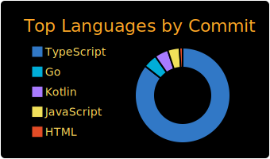
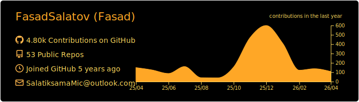
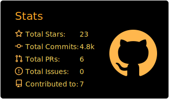
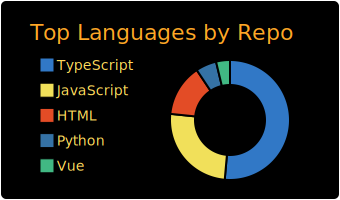
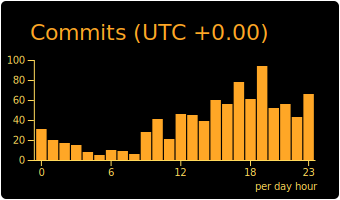

<!-- ========================================================================
     fasad.sys // NERV terminal  —  profile readme
     Synced with https://nerv-fasad.netlify.app
     ======================================================================== -->

<!-- HERO: animated waving capsule banner, amber gradient -->
<a href="https://nerv-fasad.netlify.app">

</a>

<!-- Cycling tagline -->
<div align="center">

<a href="https://nerv-fasad.netlify.app">

</a>

<!-- Profile views counter (animated underline) -->


<br/><br/>

<!-- Links -->
<a href="https://nerv-fasad.netlify.app"></a>
<a href="https://t.me/Fasad_Salatov"></a>
<a href="https://x.com/Fasad_Salatov"></a>
<a href="mailto:salatiksama@gmail.com"></a>
<a href="https://github.com/Solafon"></a>

</div>

---

<!-- BOOT SEQUENCE: typed out line-by-line, looped -->
<div align="center">


</div>

---

## `> whoami`

Senior full-stack engineer. 11 лет в проде. 137+ репозиториев. Работаю как **drop-in tech-lead** — захожу в проект, закрываю задачу end-to-end, ухожу с работающим прод-решением.

Специализация:
- **Agent-dev systems** — core LLM + swarm маленьких моделей + детерминистичные скрипты
- **MEV / on-chain** — арбитраж, ликвидаторы, индексеры (EVM + TON)
- **Telegram products** — mini-apps, бот-экосистемы, Stars payments, до 100k+ MAU
- **High-load бэки** — Node / Go / Rust + Postgres / Redis / k8s, наблюдаемость из коробки
- **Creative code** — Three.js, Canvas, GLSL шейдеры, моды для Minecraft / Gmod

---

<!-- Section divider animated -->
<div align="center">

</div>

<table>
<tr>
<td valign="top" width="33%">

**U-01 · Languages**
```
TypeScript    █████
Python        █████
Rust          ████·
Go            ████·
Solidity      ████·
Java/Kotlin   ████·
Swift         ███··
C / C++       ███··
Bash / SQL    █████
```

</td>
<td valign="top" width="33%">

**U-02 · Frontend**
```
React / Next  █████
Tailwind CSS  █████
Three.js/WGL  ████·
framer-motion ████·
Canvas / SVG  █████
Vite/Turbopak █████
```

</td>
<td valign="top" width="33%">

**U-03 · Backend · Data**
```
Node / Bun    █████
NestJS/Expres █████
FastAPI/Djang ████·
Go services   ████·
PostgreSQL    █████
MongoDB       ████·
Redis/RabbitM ████·
gRPC / WS     ████·
```

</td>
</tr>
<tr>
<td valign="top">

**U-04 · AI · Agent-dev**
```
Agent pattern █████
LLM orchestr. █████
RAG / pgvect. █████
Fine-tune LM  ████·
Whisper / TTS ████·
vLLM / ollama ████·
Tool calling  █████
```

</td>
<td valign="top">

**U-05 · Web3 · MEV**
```
MEV bots      █████
Flashbots     ████·
EVM / viem    █████
TON Connect   █████
Solana        ███··
Indexers      ████·
DeFi plumbing ████·
Wallets       █████
```

</td>
<td valign="top">

**U-06 · Infra · DevOps**
```
Docker/Compos █████
k8s / helm    ████·
GH Actions    █████
nginx/caddy   █████
Linux / shell █████
Observabilty  ████·
Cloudflare    █████
```

</td>
</tr>
</table>

<div align="center">

</div>

---

<div align="center">

</div>

Текущие и недавние операции. Полный список — [nerv-fasad.netlify.app](https://nerv-fasad.netlify.app).

| ID | Name | Type | Status | Stack |
|:--:|:--|:--:|:--:|:--|
| **OP-00** | [agent-dev/core](https://nerv-fasad.netlify.app) — orchestrator + swarm + scripts | `ai` | 🟢 live | Python · TS · LLM |
| **OP-01** | [Solafon](https://github.com/Solafon) — iOS + Android + MCP server | `crypto` | 🟢 live | Swift · Kotlin · TS · TON |
| **OP-02** | mev-engine — arbitrage + bundle stack на EVM | `mev` | 🟢 live | Rust · Go · Solidity |
| **OP-08** | liquidator-bot — on-chain ликвидатор | `mev` | 🟢 live | Go · Solidity |
| **OP-07** | swarm-ner — small-LM NER роутер | `ai` | 🟢 live | Python · vLLM |
| **OP-20** | chain-indexer — on-chain индексер + API для ботов | `mev` | 🟢 live | Rust · Postgres |
| **OP-04** | Quantex — TG mini-app + desktop фронт | `crypto` | 🟡 wip | Next.js · TG Mini Apps |
| **OP-05** | Crybble — бэкенд + админка крипто-проекта | `crypto` | 🟡 wip | NestJS · PostgreSQL |
| **OP-18** | Ai-Agregator — единый API над зоопарком LLM | `ai` | 🟡 wip | TS · Python |
| **OP-06** | [TbccGifts](https://github.com/TBCC-COIN/TbccGifts) — интеграция с TBCC | `bots` | 🟢 live | Node.js · TG Bot API |
| **OP-19** | MiniAppRabbit — TG mini-app с игровой механикой | `bots` | 🟢 live | React · TG Mini Apps |
| **OP-13** | [ReadmeMdConstructor](https://github.com/FasadSalatov/ReadmeMdConstructor) | `tools` | 🟢 live | JS · Markdown |
| **OP-14** | [ASCHII-GEN](https://github.com/FasadSalatov/ASCHII-GEN) | `tools` | 🟢 live | JS |
| **OP-10** | [SpaceWarGame](https://github.com/FasadSalatov/SpaceWarGame) | `games` | 🟢 live | JS · Canvas |
| **OP-12** | [TTT-TTS-Plugin](https://github.com/FasadSalatov/TTT-TTS-Plugin-for-Garry-s-Mod) | `games` | 🟢 live | Lua · GMod |
| **OP-03** | [Nullphoria](https://github.com/FasadSalatov/Nullphoria-site) | `web` | ⚫ archived | Next.js · motion |

---

<div align="center">

</div>

<table>
<tr>
<td width="50%" valign="top">

### `SENIOR` · Full-stack engineering
Архитектура, high-load бэки, фронт с характером, CI/CD под ключ.
> _от MVP до прод · команда 1–5_

### `AI` · Agent-dev systems
Системы из core LLM + swarm маленьких моделей + детерминистичных скриптов. Меньше цена, больше скорость.
> _RAG · tool-calling · eval_

### `WEB3` · MEV / on-chain bots
Arbitrage, sandwich-защита, ликвидаторы, индексеры. EVM + TON. Работают 24/7 без нянек.
> _Rust · Go · Solidity · TON_

</td>
<td width="50%" valign="top">

### `TG` · Telegram products
Mini-apps, bot ecosystems, платёжки. От MVP до 100k+ MAU. Доли секунд и честные анимации.
> _Mini Apps · Bot API · Stars_

### `OPS` · Infra & DevOps
Linux · Docker · k8s · CI · observability. Ставлю так, чтобы работало в три часа ночи.
> _GH Actions · k8s · Cloudflare_

### `GAME` · Games & creative code
Canvas / WebGL / Three.js, моды для Minecraft, Gmod-плагины, шейдеры, motion-дизайн.
> _Three.js · Phaser · Forge · Lua_

</td>
</tr>
</table>

---

<div align="center">

</div>

```
01  Не плати за flagship-модель там, где хватит regex-а.
02  Deterministic скрипты > агенты, везде, где можно.
03  Маленькая модель под задачу бьёт большую — если узкая задача.
04  Boilerplate — это налог. Не платить.
05  Прод > демо. Всё должно жить после захода заказчика.
06  Если не мониторится — этого не существует.
07  Анимация должна быть честной — 60fps или не нужна вовсе.
08  Ship it. А потом ещё раз. А потом ещё.
```

---

<div align="center">

</div>

<!-- Live stats cards: NERV-tuned -->
<div align="center">


</div>

<!-- Animated activity graph -->
<div align="center">

</div>

<!-- Trophy + top langs -->
<div align="center">

</div>

<div align="center">


</div>

<!-- Snake animation -->
<div align="center">
  
</div>

<!-- MAGI profile summary cards -->
<div align="center">




</div>

---

<div align="center">

</div>

```
▸ site       https://nerv-fasad.netlify.app
▸ telegram   @Fasad_Salatov
▸ x          @Fasad_Salatov
▸ github     github.com/FasadSalatov
▸ email      salatiksama@gmail.com
▸ org        Solafon  ·  github.com/Solafon
```

<!-- Quote cycle -->
<div align="center">


<br/>

<a href="https://nerv-fasad.netlify.app">
  
</a>

</div>
