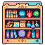
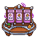
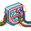
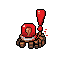

<!-- ========================================================================
     fasad.sys // NERV terminal — profile readme v2
     Mirrors: https://nerv-fasad.netlify.app
     ======================================================================== -->

<!-- HERO -->
<a href="https://nerv-fasad.netlify.app">

</a>

<!-- Cycling tagline -->
<div align="center">

<a href="https://nerv-fasad.netlify.app">

</a>

<br/>


<br/><br/>

<a href="https://nerv-fasad.netlify.app"></a>
<a href="https://t.me/Fasad_Salatov"></a>
<a href="https://x.com/Fasad_Salatov"></a>
<a href="mailto:salatiksama@gmail.com"></a>
<a href="https://unyly.org"></a>

</div>

---

<!-- PIXEL HUD: subsystems status -->
<div align="center">

### `> systemctl status subsystems`

<table>
<tr>
<td align="center" width="12.5%"><br/><sub><b>CATALOG</b><br/><code>online</code></sub></td>
<td align="center" width="12.5%"><br/><sub><b>BOARDS</b><br/><code>online</code></sub></td>
<td align="center" width="12.5%"><br/><sub><b>INSTALL</b><br/><code>online</code></sub></td>
<td align="center" width="12.5%"><br/><sub><b>DISCOVERY</b><br/><code>scanning</code></sub></td>
<td align="center" width="12.5%"><br/><sub><b>OPS</b><br/><code>armed</code></sub></td>
<td align="center" width="12.5%"><br/><sub><b>ORACLE</b><br/><code>online</code></sub></td>
<td align="center" width="12.5%"><br/><sub><b>CLEANUP</b><br/><code>weekly</code></sub></td>
<td align="center" width="12.5%"><br/><sub><b>INBOX</b><br/><code>online</code></sub></td>
</tr>
</table>

</div>

---

<!-- BOOT SEQUENCE -->
<div align="center">


</div>

---

## `> whoami`

Senior full-stack engineer. **11 лет в проде. 137+ репозиториев.** Работаю как **drop-in tech-lead** — захожу в проект, закрываю задачу end-to-end, ухожу с работающим прод-решением.

**Специализация:**
- 🤖 **Agent-dev systems** — core LLM + swarm маленьких моделей + детерминистичные скрипты для надёжности
- ⛓ **MEV / on-chain** — арбитраж, ликвидаторы, индексеры (EVM + TON)
- 📱 **Telegram products** — mini-apps, бот-экосистемы, Stars payments, до 100k+ MAU
- ⚡ **High-load бэки** — Node / Go / Rust + Postgres / Redis / k8s, observability из коробки
- 🎨 **Creative code** — Three.js, Canvas, GLSL шейдеры, моды для Minecraft / Gmod

---

## `> ls /projects/active`

<table>
<tr>
<td valign="top" width="50%">

### 🦄 [unyly.org](https://unyly.org)
**MCP Marketplace для Claude.** 11 700+ серверов в каталоге, one-click install, AI-поиск с SSE-стримом, OpenAPI→MCP конвертер. Boards + AI-агенты (Tester-Relay, Daily-Standup, MCP-Discovery), Trello-integration с live-sync.

`Next.js 16` · `Drizzle` · `SQLite` · `Tailwind 4` · `better-auth`

</td>
<td valign="top" width="50%">

### 🤖 NERV agent platform
Локальные AI-агенты на Claude Agent SDK. Pull Trello → Claude CLI → действует в твоём репо. Без облака, без подписок, без БД серверной.

`@anthropic-ai/claude-agent-sdk` · `Node` · `Trello API`

</td>
</tr>
<tr>
<td valign="top">

### ⛓ MEV / on-chain bots
Арбитраж DEX, sandwich-resistant flow, ликвидаторы. EVM (viem + Flashbots) и TON. Прод-deploy через свою webhook-инфру с автоматическим Telegram-уведомлением.

`Rust` · `viem` · `TON Connect` · `Flashbots`

</td>
<td valign="top">

### 🚀 Деплой-инфра (open infrastructure)
Один VPS обслуживает 7+ продакшен-проектов: `git push prod` → webhook → SSH-deploy → GitHub deployment status → Telegram-уведомление с прогрессом стейджей и AI-разбором фейлов через Haiku.

`Express` · `PM2` · `Anthropic API` · `Bot API 9.4`

</td>
</tr>
</table>

---

<div align="center">

</div>

<table>
<tr>
<td valign="top" width="33%">

**U-01 · Languages**
```
TypeScript    █████
Python        █████
Rust          ████·
Go            ████·
Solidity      ████·
Java/Kotlin   ████·
Swift         ███··
C / C++       ███··
Bash / SQL    █████
```

</td>
<td valign="top" width="33%">

**U-02 · Frontend**
```
React / Next  █████
Tailwind CSS  █████
Three.js/WGL  ████·
framer-motion ████·
Canvas / SVG  █████
Vite/Turbopak █████
```

</td>
<td valign="top" width="33%">

**U-03 · Backend · Data**
```
Node / Bun    █████
NestJS/Expres █████
FastAPI/Djang ████·
Go services   ████·
PostgreSQL    █████
MongoDB       ████·
Redis/RabbitM ████·
gRPC / WS     ████·
```

</td>
</tr>
<tr>
<td valign="top">

**U-04 · AI · Agent-dev**
```
Agent pattern █████
LLM orchestr. █████
RAG / pgvect. █████
Fine-tune LM  ████·
Whisper / TTS ████·
vLLM / ollama ████·
Tool calling  █████
Claude SDK    █████
```

</td>
<td valign="top">

**U-05 · Web3 · MEV**
```
MEV bots      █████
Flashbots     ████·
EVM / viem    █████
TON Connect   █████
Solana        ███··
Indexers      ████·
DeFi plumbing ████·
Wallets       █████
```

</td>
<td valign="top">

**U-06 · Infra · DevOps**
```
Docker/Compos █████
k8s / helm    ████·
GH Actions    █████
nginx/caddy   █████
Linux / shell █████
Observabilty  ████·
Cloudflare    █████
PM2 / systemd █████
```

</td>
</tr>
</table>

---

<div align="center">

</div>

<div align="center">


</div>

<!-- Snake contribution graph (генерится отдельным GH Action в output branch) -->
<div align="center">

<picture>
  <source media="(prefers-color-scheme: dark)" srcset="https://raw.githubusercontent.com/FasadSalatov/FasadSalatov/output/github-contribution-grid-snake-dark.svg" />
  <source media="(prefers-color-scheme: light)" srcset="https://raw.githubusercontent.com/FasadSalatov/FasadSalatov/output/github-contribution-grid-snake.svg" />
  
</picture>

</div>

---

<div align="center">

</div>

```diff
+ pnpm, не npm. install в 2026 уже стыдно
+ Trello-Linear sync через AI: тестер пишет — нормализованный тикет в Linear
+ AI-агенты на каждый workflow (standup, PR-review, prod-incident, zombie)
+ Glass UI > flat. Pixel-art + backdrop-blur — лучший компромисс ностальгии и production
+ Cryptomus, не Stripe — крипто-биллинг без danse с PCI
+ Свой webhook-deploy сервер, не GitHub Actions. Контроль, нет минут-квот
- vibe coding без тестов — на pre-launch ок, на проде = неделя на root cause
- LLM везде — нет. Детерминистичный fallback на каждом критичном шаге
```

---

<div align="center">

</div>

<table>
<tr>
<td align="center" width="33%">

### 💼 Заказная разработка

Next.js / Go / Python / интеграции. Средние и большие проекты.<br/>MVP за 2-3 недели, прод за 6-8.

</td>
<td align="center" width="33%">

### 🧠 CTO-консалтинг

Архитектура, выбор стека, найм первой команды.<br/>Звонок 30 мин — бесплатно.

</td>
<td align="center" width="33%">

### 🤖 AI-агенты под workflow

Claude-based автоматизация под твою рутину.<br/>Trello → Linear / GitHub bot / DevOps.

</td>
</tr>
</table>

<div align="center">

**[`telegram → @Fasad_Salatov`](https://t.me/Fasad_Salatov)** · **[`mail → salatiksama@gmail.com`](mailto:salatiksama@gmail.com)** · **[`x → @Fasad_Salatov`](https://x.com/Fasad_Salatov)**

</div>

---

<div align="center">
<sub>powered by ☕, <code>pnpm</code> и pixel-art от <a href="https://pixellab.ai">pixellab.ai</a> · last boot — </sub>
</div>

<!-- ========================================================================
     End of fasad.sys profile readme v2.
     get in the robot, Shinji.
     ======================================================================== -->
